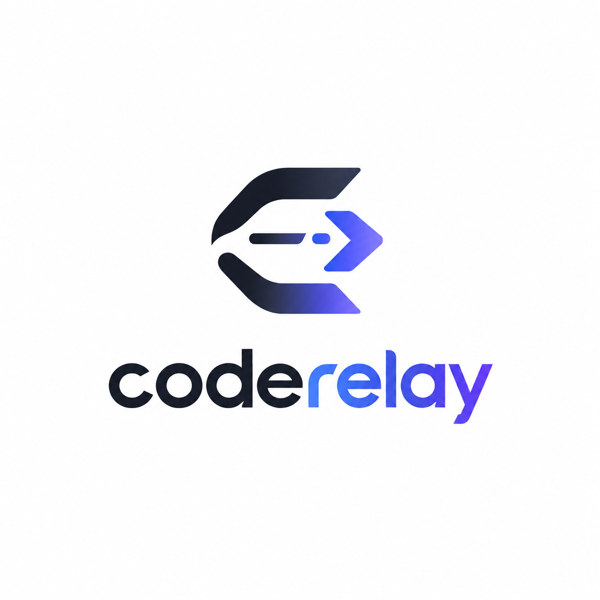

<p align="center">
  
</p>

<h1 align="center">coderelay</h1>

<p align="center">
  <strong>The Intelligent Traffic Router for Coding Agent CLIs.</strong><br>
  扫描本机编码 Agent，按规则、模型评分或 AI 意图，把任务精准分发给最合适的 CLI。
</p>

<p align="center">
  <a href="package.json"></a>
  <a href="https://bun.sh"></a>
  <a href="https://www.typescriptlang.org"></a>
  <a href="LICENSE"></a>
  
</p>

---

## 目录

- [为什么需要 coderelay](#为什么需要-coderelay)
- [核心特性](#核心特性)
- [支持的 Agent 矩阵](#支持的-agent-矩阵)
- [快速开始](#快速开始)
  - [全局安装](#全局安装)
  - [源码运行](#源码运行)
  - [版本升级](#版本升级)
- [使用指南](#使用指南)
  - [1. 交互式 TUI 模式（默认）](#1-交互式-tui-模式默认)
  - [2. CLI 任务路由模式（run）](#2-cli-任务路由模式run)
  - [3. 初始化偏好管理（favorite）](#3-初始化偏好管理favorite)
  - [4. 环境与规则诊断（doctor / agents / models）](#4-环境与规则诊断doctor--agents--models)
- [决策模式（Routing Modes）](#决策模式routing-modes)
- [配置说明](#配置说明)
- [架构设计](#架构设计)
- [本地开发](#本地开发)
- [开源协议](#开源协议)

---

## 为什么需要 coderelay

当前开发者终端里通常同时安装了多个 Coding Agent：

- **Claude Code**：擅长复杂架构推理、长上下文理解与大型重构。
- **Codex CLI**：擅长工具链调用、标准代码补全与紧凑指令执行。
- **pi / omp**：适合特定轻量任务或垂直模型场景。

**痛点**：每次切换任务都要手动寻找命令、适配命令行参数、人肉权衡模型成本与上下文窗口。

**解决方案**：`coderelay` 作为统一接入网关，自动扫描本机可用 Agent。根据提示词特征、代码语言、上下文规模或远程 AI 路由器，将任务分配给最佳 Agent 并直接接管 TTY 会话；没有参数时提供基于 Ink 的终端全屏交互界面。

---

## 核心特性

- 🔍 **环境自动发现**：自动跨平台（macOS / Linux / Windows / WSL）检测 PATH 与已知安装路径，探测 CLI 版本与可用性。
- 🎯 **三模智能路由**：
  - `local`（默认）：规则匹配（关键词、正则、文件 Glob、语言、长度）+ 综合评分（能力模型、Token 成本、默认偏好）。
  - `jev`：接入 Typesafe SystemOne 智能决策大模型，理解复杂提示词并产出最优分发路径。
  - `manual`：显式指定 `-a/--agent` 或 `-m/--model`，精准直通。
- 🖥️ **交互式全屏 TUI**：基于 React + Ink 构建，涵盖环境扫描、Agent 激活确认、模型探针、任务录入与流式执行。
- 💾 **SQLite 状态持久化**：内置轻量级 SQLite 存储，支持多轮会话追踪与最爱初始 Agent（`favorite`）记忆。
- 🛡️ **干净进程生命周期**：原生 TTY 透传交互，错误与路由诊断输出至 stderr，支持 `--timeout` 守护。
- ⚙️ **零配置起步 & Zod 校验**：无配置文件直接使用内置策略；亦可在 `.coderelay/config.yaml` 深度定制规则与权重。

---

## 支持的 Agent 矩阵

`coderelay` 通过专属与通用适配器统一抽象各 CLI 的调用范式：

| Agent | CLI 命令 | 适配机制 | 说明 |
|---|---|---|---|
| **Claude Code** | `claude` | 专属适配器 | 自动注入 `--dangerously-skip-permissions`、模型切换参数与上下文提示 |
| **Codex CLI** | `codex` | 专属适配器 | 支持 `--model`、`--context-window` 及配置级额外参数 |
| **Pi** | `pi` | 通用适配器 | 参数按标准约定传递，自动版本探针 |
| **OMP** | `omp` | 通用适配器 | 参数按标准约定传递，自动版本探针 |

> 提示：运行 `coderelay agents` 可即时查看本机安装与适配状态。

---

## 快速开始

### 全局安装

推荐通过 npm 或 bun 全局安装：

```bash
# 使用 npm
npm i -g @alkaidstart/coderelay

# 或使用 bun
bun add -g @alkaidstart/coderelay
```

安装后提供两个命令入口：`coderelay` 以及更短的双字母别名 `cr`。

```bash
cr --version
```

### 源码运行

```bash
git clone https://github.com/AlkaidSTART/coderelay.git
cd coderelay
bun install

# 启动开发版 TUI
bun run dev

# 运行特定命令
bun run dev run "修复登录鉴权竞态问题"
```

### 版本升级

由于 npm registry 对 dist-tag 元数据有默认缓存，建议加 `--prefer-online` 确保安装最新版：

```bash
npm i -g @alkaidstart/coderelay@latest --prefer-online
```

---

## 使用指南

### 1. 交互式 TUI 模式（默认）

在项目根目录下直接运行 `cr` 或 `coderelay`：

```bash
cr
```

终端将启动交互式面板：
1. **环境探测**：自动扫描并列出可用 Agent。
2. **选择目标**：可直接使用已持久化的最爱 Agent 或即时选择。
3. **编写任务**：输入待处理的编码任务描述。
4. **实时执行**：直接无缝桥接到目标 Agent CLI。

### 2. CLI 任务路由模式（run）

直接向 Agent 分发单条任务：

```bash
# 智能走完整规则与评分路由
coderelay run "重构 router 模块的评分逻辑，补齐 TypeScript 类型"

# 显式使用 Claude Code 跳过自动路由
coderelay run -a claude "执行全量单元测试并修复所有报错"

# 显式指定模型
coderelay run -m codex:gpt-5-codex "优化 SQL 查询性能"

# 附带上下文信号，帮助路由引擎精确评分
coderelay run \
  --lang typescript \
  --file src/router/scorer.ts \
  --strength long-context \
  --strength reasoning \
  "解析大型 AST 树并提取所有循环依赖"
```

#### `run` 命令参数速查

| 选项 | 简写 | 类型 | 说明 |
|---|---|---|---|
| `--mode <mode>` | `-M` | `local` \| `manual` \| `jev` | 决策模式（默认 `local`） |
| `--agent <id>` | `-a` | string | 显式指定目标 Agent（跳过路由计算） |
| `--model <model>` | `-m` | string | 显式指定目标模型或 `agent:model` |
| `--cwd <path>` | `-C` | string | 指定扫描与执行的工作目录 |
| `--config <path>` | `-c` | string | 指定自定义配置文件路径 |
| `--file <path>` | - | string[] | 任务相关文件路径（可多次传入，供规则匹配） |
| `--lang <language>` | - | string | 代码语言标识（如 `typescript`、`go`） |
| `--strength <type>` | - | string[] | 期望能力：`coding`、`reasoning`、`long-context`、`tool-use`、`fast`、`cheap`、`creative`、`multimodal` |
| `--context-size <tokens>` | - | number | 预估上下文 Token 规模，参与评分模型加权 |
| `--timeout <ms>` | - | number | 超时守护：超时后自动中止目标 Agent 进程 |

### 3. 初始化偏好管理（favorite）

设置日常最习惯的默认初始 Agent，配置将保存在本地 SQLite 数据库中：

```bash
# 查看当前偏好
coderelay favorite

# 设置 Claude Code 为偏好
coderelay favorite claude

# 使用短别名设置 Codex
cr fav codex

# 清除偏好
cr fav clear
```

### 4. 环境与规则诊断（doctor / agents / models）

```bash
# 全面诊断：检查配置文件有效性、语法规则、已安装 CLI 及路径
coderelay doctor

# 查看支持的 Agent 列表、版本与本机就绪状态
coderelay agents

# 查看配置的模型列表、能力标签、费用与兜底默认值
coderelay models
```

---

## 决策模式（Routing Modes）

| 模式 | 标志 | 机制说明 | 适用场景 |
|---|---|---|---|
| **Local 模式** | `-M local` | **规则优先 + 评分兜底**。<br>按优先级匹配配置中的关键词、正则、语言与文件，无匹配时按 Agent 能力模型与 Token 成本加权计算。 | 日常开发、私密环境、无外部网络调用依赖。 |
| **Jev 模式** | `-M jev` | **AI 意图路由**。<br>调用 Typesafe SystemOne API（`jev-latest` 模型），结合本地安装候选列表与任务意图做出智能决策。 | 复杂模糊意图、需要高阶语义分析的任务分发。 |
| **Manual 模式** | `-M manual` | **直接穿透**。<br>直接校验指定的 Agent 与模型可用性，跳过所有路由算法。 | 确定只想用某一个 CLI 时的精准分发。 |

> **启用 Jev 模式**：只需在环境变量或 `.env.local` 中配置 `TYPESAFE_API_KEY`：
> ```bash
> export TYPESAFE_API_KEY="your-api-key"
> coderelay run -M jev "审计这个项目的安全漏洞"
> ```

---

## 配置说明

`coderelay` 会从当前工作目录向上自动递归查找 `.coderelay/config.yaml`（或 `.yml`、`coderelay.config.yaml`）。

所有配置项均有内置默认值且经过 Zod 强类型校验。

```yaml
version: 1
defaultAgent: codex                  # 无法命中特定规则时的兜底 Agent
defaultModel: codex:gpt-5-codex      # 兜底默认模型

# Agent 自定义配置
agents:
  claude:
    enabled: true
    command: /usr/local/bin/claude   # 可选：显式重写二进制文件绝对路径
    extraArgs: ["--dangerously-skip-permissions"]
    env: {}
  codex:
    enabled: true
    models:
      - id: gpt-5-codex
        label: GPT-5 Codex
        strengths: [coding, tool-use]
        cost: 3                      # 成本等级：1 (极低) ~ 5 (极高)
        default: true

# 路由规则与权重
routing:
  strategy: hybrid                   # hybrid (规则+评分) | rules | score
  rules:
    - name: 深度重构与长文本任务
      priority: 10                   # 优先级数值越大越优先匹配
      when:
        minPromptLength: 2000
        keywords: ["refactor", "重构", "架构"]
      use:
        agent: claude
      score: 25                      # 命中时为候选目标增加的分值

    - name: 前端样式与简单脚本
      priority: 5
      when:
        languages: ["css", "html", "bash"]
      use:
        agent: pi
      score: 15

  # 评分权重调整
  weights:
    strength: 1.0                    # 每命中一项 strength 标签的分值
    rule: 1.0                        # 规则 score 的放大乘数
    default: 2.0                     # 默认 agent/model 的加权基础分
    cost: 0.5                        # 成本惩罚系数（cost 越高扣分越多）
    context: 1.0                     # 大请求匹配 long-context 能力的奖励分
```

---

## 架构设计

`coderelay` 遵循清晰的单向数据流与分层管道架构：

<picture>
  <source media="(prefers-color-scheme: dark)" srcset="assets/architecture-dark.png">
  
</picture>

> 💡 **交互式架构图**：在浏览器中打开 [assets/architecture.html](assets/architecture.html)，可在线缩放、按节点筛选依赖、追踪调用链及切换暗黑/浅色主题。

---

## 本地开发

本项目使用 [Bun](https://bun.sh) 作为运行时与工具链：

```bash
# 1. 克隆并安装依赖
git clone https://github.com/AlkaidSTART/coderelay.git
cd coderelay
bun install

# 2. 运行测试套件（内置 230+ 单元与集成测试）
bun test

# 3. 静态类型检查
bun run typecheck

# 4. 本地启动开发 CLI
bun run dev
```

---

## 开源协议

本项目采用 [MIT License](LICENSE) 授权许可。
