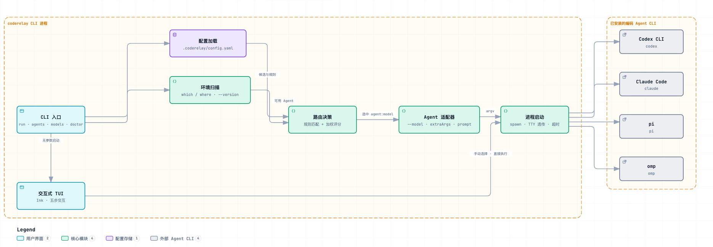

# coderelay

> 把编码任务路由到最合适的 Coding Agent CLI。

<picture>
  <source media="(prefers-color-scheme: dark)" srcset="assets/architecture-dark.png">
  
</picture>

coderelay 会扫描本机已安装的编码 Agent CLI（Codex、Claude Code、pi、omp），根据配置中的规则与评分策略为每个任务挑选最合适的 agent 和模型，然后直接在你的终端里启动它。不带参数时进入交互式 TUI。

## 特性

- **多 Agent 支持** — codex、claude 走专属适配器，pi、omp 走通用适配器；未安装的自动标记为不可用
- **规则 + 评分混合路由** — 规则按 keywords / 正则 / 语言 / 文件 / 提示词长度命中，评分综合模型能力（strengths）、成本（cost）、默认偏好与上下文规模
- **三种路由策略** — `hybrid`（默认：规则优先、评分兜底）、`rules`、`score`
- **声明式配置** — `.coderelay/config.yaml`，Zod 全量校验；所有字段可省略，零配置即可使用
- **交互式 TUI** — 扫描 → 选择 → 写任务 → 执行 → 结果，五步完成一次会话
- **干净的输出边界** — Agent 进程 TTY 直接透传，路由与错误诊断写 stderr；`--timeout` 可中断

## 环境要求

- [Bun](https://bun.sh)
- 至少安装一个受支持的 Agent CLI（用 `coderelay agents` 查看检测状态）

| Agent | 命令 | 适配方式 |
|-------|------|----------|
| Codex CLI | `codex` | 专属适配器 |
| Claude Code | `claude` | 专属适配器 |
| pi | `pi` | 通用适配器 |
| omp | `omp` | 通用适配器 |

## 快速开始

全局安装后，在任意目录直接敲 `coderelay` 就会全屏接管终端：

```bash
npm i -g @alkaidstart/coderelay

coderelay
```

不带参数进入交互式 TUI（扫描 → 选择 → 写任务 → 执行 → 结果），带参数则直接把任务路由给最合适的 Agent：

```bash
coderelay run "重构 src/router 里的评分逻辑，补齐类型"
```

从源码跑：

```bash
git clone https://github.com/AlkaidSTART/coderelay.git
cd coderelay && bun install

bun run dev
bun run dev run "重构 src/router 里的评分逻辑，补齐类型"
```

## 更新

```bash
npm i -g @alkaidstart/coderelay@latest
coderelay --version
```

## 命令

### `coderelay run`

```
coderelay run [prompt...] [options]
```

| 选项 | 说明 |
|------|------|
| `-a, --agent <id>` | 显式指定 Agent，跳过路由（仍会校验启用与安装状态） |
| `-m, --model <model>` | 显式模型或 `agent:model` 引用，跳过路由 |
| `-C, --cwd <path>` | 扫描与执行使用的工作目录 |
| `-c, --config <path>` | 显式配置文件路径 |
| `--file <path>` | 提供给路由规则的请求文件，可重复传入 |
| `--lang <language>` | 提供给路由规则的语言标识 |
| `--context-size <tokens>` | 预估上下文规模，参与评分 |
| `--strength <strength>` | 要求的模型能力，可重复；见下表 |
| `--timeout <ms>` | 超时后终止选中的 Agent |

可选的 `--strength` 取值：`coding`、`reasoning`、`long-context`、`tool-use`、`fast`、`cheap`、`creative`、`multimodal`。

```bash
bun run dev run "修复登录页的竞态条件"                    # 走完整路由
bun run dev run -a claude "跑一遍测试并修复失败项"         # 跳过路由，直接用 Claude Code
bun run dev run -m codex:gpt-5-codex "优化这个查询"       # 显式 agent:model
bun run dev run --lang go --file main.go --strength long-context "拆分这个包"
```

### 其他命令

| 命令 | 说明 |
|------|------|
| `coderelay`（无参数） | 进入交互式 TUI：扫描 → 选择 → 写任务 → 执行 → 结果 |
| `coderelay agents` | 列出支持的 Agent 与本机安装状态 |
| `coderelay models` | 列出配置中的模型与路由默认值 |
| `coderelay doctor` | 检查配置、路由规则与已安装的 CLI |

## 配置

配置从当前目录向上查找：`.coderelay/config.yaml`、`.coderelay/config.yml`、`coderelay.config.yaml`、`coderelay.config.yml`，找不到时使用内置默认值（默认 Agent 为 `codex`）；`-c` 可显式指定路径。

```yaml
version: 1
defaultAgent: codex                  # 评分没有明确赢家时的兜底
defaultModel: codex:gpt-5-codex

agents:
  codex:
    enabled: true
    command: /opt/homebrew/bin/codex # 可选：覆盖可执行文件路径
    models:
      - id: gpt-5-codex
        label: GPT-5 Codex
        strengths: [coding, tool-use]
        cost: 3                      # 1（最便宜）– 5（最贵）
        default: true
    extraArgs: []                    # 追加在提示词之前的参数
    env: {}                          # 子进程额外环境变量

routing:
  strategy: hybrid                   # rules / score / hybrid
  rules:
    - name: 长上下文任务
      priority: 10                   # 越大越先评估
      when:
        minPromptLength: 4000        # 还支持 keywords / patterns / languages / files / maxPromptLength
      use:
        agent: claude                # 命中后的目标 agent / model
        model: opus
      score: 20                      # 目标获得的加成分
  weights:                           # 评分权重，均可省略
    strength: 1                      # 每个匹配能力的加分
    rule: 1                          # 规则加成分的乘数
    default: 2                       # 默认 agent/model 的加分
    cost: 0.5                        # 成本档位惩罚
    context: 1                       # 大请求匹配 long-context 的加分
```

## 工作原理

`run` 命令按上图中的管线执行：

1. **加载配置** — 从 cwd 向上查找 YAML 配置并用 Zod 校验
2. **环境扫描** — `which` / `where` 解析各 Agent CLI 路径并探测版本（Windows 含兜底路径）
3. **构建候选** — 可用 Agent × 配置中的模型
4. **路由决策** — 规则按优先级匹配，`hybrid` 策略下评分兜底，产出 `agent:model` 与决策理由
5. **构建参数** — 适配器组装 `--model`、`extraArgs` 与提示词
6. **启动进程** — stream 模式透传 TTY，支持 `--timeout`；诊断信息写 stderr

`--agent` / `--model` 显式指定时跳过第 3–4 步。交互式 TUI 复用扫描与启动层，选定 Agent 后直接进入执行。

图中源文件是可交互的 [assets/architecture.html](assets/architecture.html)：在浏览器中打开可缩放、搜索节点、追踪关系、切换明暗主题。

## 开发

```bash
bun install
bun test            # 运行测试
bun run typecheck   # tsc --noEmit
bun run dev         # 本地运行 CLI
```

## License

[MIT](LICENSE)
